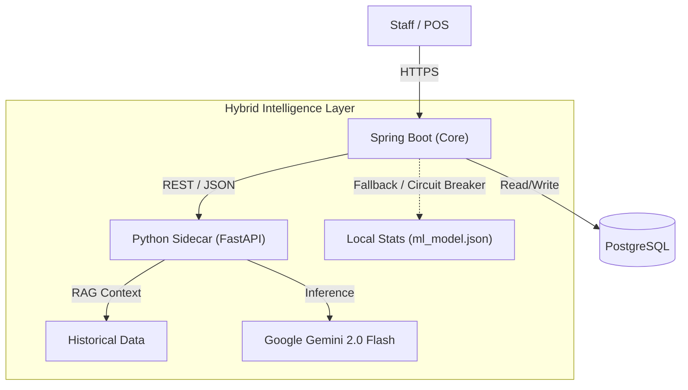

# The Baker: Intelligent Retail Operations Platform

> **A production-grade architecture that bridges Customer Experience (CX) and Operational Efficiency using Hybrid AI.**

## Project Scope
Small bakeries face two critical problems: **Demand Volatility** (weather-dependent sales) and **Operational Waste** (perishable inventory). *The Baker* solves both by unifying them into a single platform:

1.  **Customer Portal:** A real-time PWA (Progressive Web App) for live inventory visibility, preventing friction ("Is the shop open?").
2.  **Staff Decision Engine:** A **Hybrid AI Agent** that predicts daily demand using Generative AI, protected by statistical guardrails.

## Architecture Overview
The application implements a **Sidecar Microservice Pattern** to leverage the strengths of two ecosystems: **Java Spring Boot** for transactional stability and **Python FastAPI** for AI inference.

### Tech Stack
* **Core Backend:** Java 17, Spring Boot 3.2 (Web, JPA, Http Interface)
* **AI Microservice:** Python 3.11, FastAPI, **Google GenAI SDK**
* **Models:** Gemini 2.0 Flash (Reasoning) + Scikit-Learn (Fallback Stats)
* **Data:** PostgreSQL (Prod) / H2 (Dev)
* **Infrastructure:** Docker, Render (PaaS), GitHub Actions

---

## The "Hybrid AI" Prediction Engine
Retail prediction requires both **Contextual Reasoning** (e.g., "Rain on a Monday usually hurts sales") and **Statistical Safety**. *The Baker* employs a **RAG (Retrieval-Augmented Generation)** pipeline with a deterministic fallback.

### Layer 1: The Generative Agent (Primary)
* **Architecture:** In-Context Learning (RAG).
* **Workflow:**
    1.  **Retrieval:** The Python service queries the CSV history to find "Nearest Neighbor" days (e.g., previous rainy Tuesdays).
    2.  **Augmentation:** It constructs a dynamic prompt containing sales velocity, weather impact, and recent trends.
    3.  **Generation:** The **Gemini LLM** reasons through the data to produce a prediction *and* a qualitative explanation.
* **Why LLM?** Unlike standard regression, the LLM understands nuance (e.g., "Sales drop in heavy rain, but rise in light drizzle") without manual feature engineering.

### Layer 2: The Statistical Guardrail (Safety Fallback)
* **Objective:** Prevent system failure if the AI Service is unreachable or hallucinates.
* **Mechanism:** A local **Linear Regression Model** (serialized in `ml_model.json`) resides in the Java memory.
* **Circuit Breaker:**
    * If the Python Microservice times out (>3s) or returns an error:
    * The system automatically degrades to the local model: $$y = \beta_0 + \beta_1(Day) + \beta_2(Rain)$$
    * **Result:** Zero downtime. The shop always gets a number.

---

## Key Engineering Highlights

### 1. "Zero-Inflated" Risk Modeling
Standard AI models struggle with "Waste Data" because it is heavily skewed towards zero (most days have no waste).
* **Solution:** We decoupled risk from the generative model.
* **Implementation:** `ml_model.json` stores a pre-calculated **"Waste Risk Score"** based on historical active-day filtering.
* **Benefit:** The Dashboard shows *Qualitative Risk* (High/Low) separately from *Quantitative Demand* (15 units), giving staff a complete decision matrix.

### 2. Real-Time Customer Synchronization
Unlike static websites, the customer view is tightly coupled with the backend inventory state.
* **Live Circuit Breaker:** The store status is automated but includes a "Manager Override" to instantly close the digital shop front if physical stock depletes.

### 3. Automated CI/CD Pipeline
* **Continuous Integration:** GitHub Actions builds the Java JAR and validates the Python dependencies on every push.
* **Secret Management:** API Keys are injected via environment variables at runtime, ensuring no credentials exist in the codebase (following **12-Factor App** methodology).

### 4. Mathematical Transparency
To build trust with non-technical staff, the system rejects "Black Box" predictions. The UI displays the **LLM's Reasoning** (e.g., *"Sales lowered due to heavy rain forecast"*) alongside the number, empowering the baker to agree or disagree.