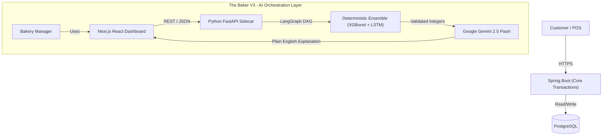

# The Baker: Intelligent Retail Operations Platform

> **A production-grade architecture that bridges Customer Experience (CX) and Operational Efficiency using Hybrid AI.**

## Project Scope
Small bakeries face two critical problems: **Demand Volatility** (weather-dependent sales) and **Operational Waste** (perishable inventory). *The Baker* solves both by unifying them into a single platform:

1.  **Customer Portal:** A real-time PWA (Progressive Web App) for live inventory visibility, preventing friction ("Is the shop open?").
2.  **Staff Decision Engine:** A **Deterministic AI Orchestrator** that mathematically predicts daily demand and waste, paired with an LLM exclusively for qualitative explanations.

## Architecture Overview
The application implements a **Microservice Pattern** to leverage the strengths of three ecosystems: **Java Spring Boot** for transactional stability, **Python FastAPI / LangGraph** for Deterministic AI inference, and **Next.js** for an operator-centric dashboard.

```mermaid
graph TD
    User["Customer / POS"] -->|HTTPS| Java["Spring Boot (Core Transactions)"]
    Java -->|Read/Write| DB[("PostgreSQL")]
    
    subgraph "The Baker V3 - AI Orchestration Layer"
        Manager["Bakery Manager"] -->|Uses| NextUI["Next.js React Dashboard"]
        NextUI -->|REST / JSON| Python["Python FastAPI Sidecar"]
        Python -->|LangGraph DAG| Ensemble["Deterministic Ensemble (XGBoost + LSTM)"]
        Ensemble -->|Validated Integers| LLM["Google Gemini 2.5 Flash"]
        LLM -->|Plain English Explanation| NextUI
    end
```

### Tech Stack
* **Storefront Backend:** Java 17, Spring Boot 3.2 (Web, JPA)
* **AI Orchestrator API:** Python 3.11, FastAPI, LangGraph
* **Forecasting Models:** XGBoost (Primary), PyTorch LSTM (Challenger)
* **Explanation Layer:** Google GenAI SDK (Strict Pydantic schemas)
* **Operations Dashboard:** Next.js, React, TypeScript
* **Data & Infrastructure:** PostgreSQL, Docker, GitHub Actions CI/CD

---

## The "V3" Prediction Ecosystem
Retail prediction requires balancing the risk of waste against the upside of sales without requiring the operator to interpret complex math. V3 explicitly abandons using LLMs for numerical forecasting (which hallucinate) in favor of a **Deterministic Dual-Target Pipeline**.

### Layer 1: The Machine Learning Mathematical Engine
* **Architecture:** XGBoost (Primary) paired with PyTorch LSTMs (Defensive Challenger).
* **Workflow:**
    1.  **Dual-Targeting:** The system explicitly predicts `sold_qty` (revenue) and `waste_qty` (loss margin) as completely separate targets.
    2.  **Anti-Leakage Features:** Uses strict `shift(1)` moving averages and 7/14/28 day sliding windows, preventing future-date leakage.
    3.  **Deterministic Ensemble:** An algorithm explicitly calculates the gap between the XGBoost and LSTM predictions. If the gap exceeds a safe threshold (> 20%), Anomaly Flags throw a circuit breaker to fall back to safe local moving averages.

### Layer 2: The LLM Explanation Orchestrator
* **Objective:** Explain the math to the baker without letting the LLM mutate the math.
* **Mechanism:** A **LangGraph DAG** strictly passes the final validated integers to Google Gemini using constrained Pydantic schemas.
* **Result:** The Dashboard displays the exact mathematical `recommended_made_qty` alongside a plain-English briefing generated by Gemini (e.g., *"Targeting 50 units today to buffer against anticipated rain downtown"*). The LLM never predicts the number.

---

## Key Engineering Highlights

### 1. Unified Microservice Monorepo
* **Solution:** The entire architecture is shipped as a Mono-repo orchestration. Running `docker-compose up` simultaneously mounts the Java Transactional App, the Python API, and the Next.js React Dashboard safely on isolated localhost ports.

### 2. Real-Time Customer Synchronization
Unlike static websites, the customer view is tightly coupled with the backend inventory state.
* **Live Circuit Breaker:** The store status is automated but includes a "Manager Override" to instantly close the digital shop front if physical stock depletes.

### 3. Automated CI/CD Pipeline
* **Continuous Integration:** GitHub Actions builds the Java JAR and validates the Python dependencies on every push.
* **Secret Management:** API Keys are injected via environment variables at runtime, ensuring no credentials exist in the codebase (following **12-Factor App** methodology).

### 4. Mathematical Transparency
To build trust with non-technical staff, the system rejects "Black Box" predictions. The UI displays the **LLM's Reasoning** (e.g., *"Sales lowered due to heavy rain forecast"*) alongside the number, empowering the baker to agree or disagree.