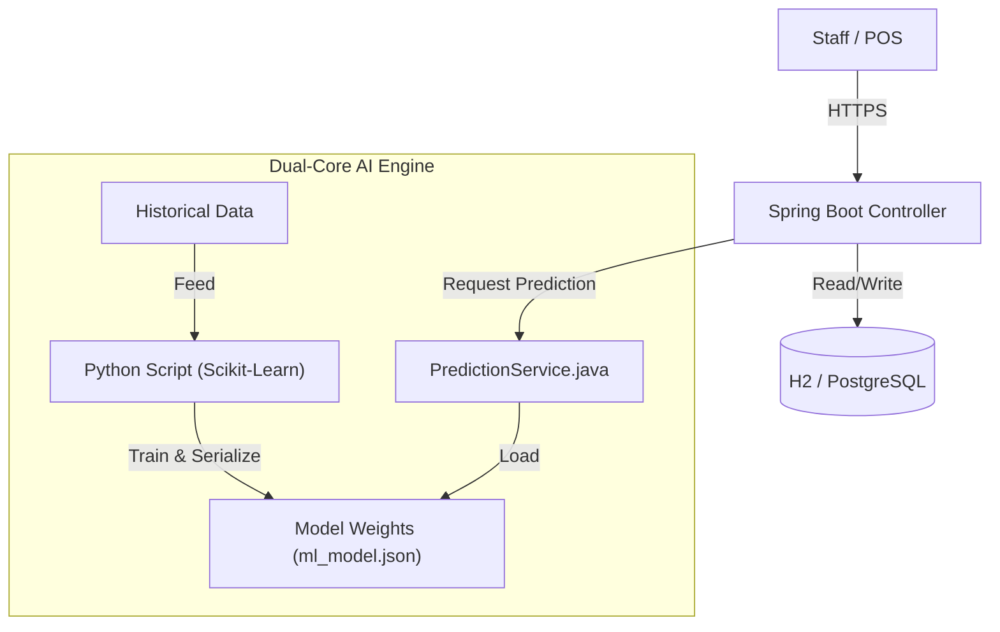

# The Baker: Smart Retail Operations Platform

> **A production-grade full-stack application that bridges the gap between Customer Experience (CX) and Operational Efficiency.**

## Project Scope
Small bakeries face two critical problems: **Customer Friction** (unsure if open, no inventory visibility) and **Operational Waste** (over-production). *The Baker* solves both by unifying them into a single platform:

1.  **Customer Portal:** A real-time PWA (Progressive Web App) for digital loyalty points, live stock visibility, and reservations.
2.  **Staff Dashboard:** An AI-assisted decision support system that uses historical sales data to recommend daily production levels, minimizing food waste.

## Architecture Overview
The application follows a **Hybrid Monolith** architecture designed for reliability and ease of deployment. It leverages **Java Spring Boot** for robust transaction handling and **Python** for statistical modeling, bridging the two via a lightweight local interface.



### Tech Stack
* **Backend:** Java 17, Spring Boot 3.2 (Web, JPA, Thymeleaf)
* **Data Science:** Python 3.x, Pandas, Scikit-Learn (Linear Regression)
* **Database:** H2 (Dev) / PostgreSQL (Prod)
* **Frontend:** Server-Side Rendering (Thymeleaf) + TailwindCSS
* **DevOps:** GitHub Actions (CI) -> Render (CD)

---

## Quick Start

```bash
# Clone the repository
git clone https://github.com/your-username/thebaker.git
cd thebaker

# Run with Gradle
./gradlew bootRun

# Access the application
# Customer Portal: http://localhost:8080
# Staff Dashboard: http://localhost:8080/staff (login: admin / admin123)
```

---

## The "Dual-Core" Prediction Logic
Retail inventory management faces two conflicting challenges: **Demand Volatility** (Weather/Day effects) and **Data Sparsity** (Waste events are rare but costly). To solve this, *The Baker* employs a hybrid strategy that decouples demand forecasting from risk assessment.

### Core 1: The Demand Model (Dynamic Regression)
* **Objective:** Predict Sales Velocity ("How many *can* we sell?").
* **Algorithm:** Multivariate Linear Regression:
$$y = \beta_0 + \beta_1x_1 + ... + \beta_nx_n$$
* **Feature Engineering:**
    * **Day of Week:** One-hot encoded vectors to capture weekly seasonality (e.g., `Saturday_Boost`).
    * **Weather:** Categorical mapping (Sunny, Rain, Snow) to impact coefficients.
    * **Temperature:** Continuous variable to model heat/cold sensitivity.
* **Logic:** The model calculates a **Base Bias** (Standard Demand) and applies weighted coefficients to generate a dynamic target.

### Core 2: The Risk Model (Sparse Data Handling)
* **Objective:** Quantify Inventory Risk ("What is the probability of over-production?").
* **Challenge:** Waste data in small businesses is **Zero-Inflated** (skewed heavily towards 0). A standard regression model treats waste events as outliers, often converging to a "Zero Risk" prediction which is dangerous for cost control.
* **Solution:** A deterministic **"Active-Day" Risk Scoring** system.
    * The system filters historical data to isolate only **Active Shelf Days** (days where production > 0).
    * It calculates a **Waste Risk Score** (Average Loss per Active Day) vs. **Production Velocity** (Average Made).

> **Analyst Note:** We intentionally separated this from the regression model because "Waste" is not a linear function of weather, but a function of operational variance. Using a simple Moving Average on filtered data provided higher recall for risk events than a complex ML model.

---

## Key Platform Capabilities

### 1. Real-Time Customer Synchronization (CX)
Unlike static websites, the customer view is tightly coupled with the backend inventory state to reduce friction.
* **Live Open/Close Logic:** The store status is automated by server time but includes a "Manager Override" (Circuit Breaker pattern) to instantly close the shop if sold out.
* **Stock Visibility:** Customers see "Low Stock" warnings in real-time as staff process orders, creating urgency and preventing wasted trips.

### 2. "What-If" Simulation Engine (AI)
The dashboard enables **Real-Time Scenario Planning**. Staff can manually override weather parameters (e.g., switch forecast from "Sunny" to "Rain") which triggers a re-calculation of prediction vectors in memory ($$O(1)$$ complexity), without needing to retrain the underlying model ($$O(N)$$).

### 3. Automated Pipeline (CI/CD)
* **Continuous Integration:** Every push triggers a build and test suite via GitHub Actions.
* **Just-in-Time Training:** The Python training script runs as a pre-build step in the pipeline. This ensures that `ml_model.json` (the inference weights) is always synchronized with the latest `history.csv` snapshot before deployment.

### 4. Mathematical Transparency
To build trust with non-technical staff, the system rejects "Black Box" predictions. The UI decomposes the final recommendation into its constituent weights:
> `Prediction` = `Base (10)` + `Saturday (+2)` + `Rain (-1)` = **11 Units**
